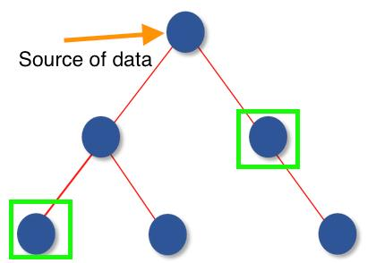

# Task 4 Question
How would you share data between components in a frontend application?

For example, consider the following DOM tree, how can you share data from the source to “node” with green boxes?




# Answer
For the traditional approach, we need to pass values from the parent component to the child component, such as the following example

```
fathers(){
    const value = "1"
    child(value)
}

child(value){
    child2(value)
}

child2(value){
    child3(value)
    child4(value)
}
```

This would be better when the number of components is relatively small, but for example, in the diagram described in the question, it is clear that the number of components is high, so we can switch to another approach.

With React, we can use React.createContext to create any value, and this value can be used as a global value, for example
```
const Context = React.createContext(defaultValue);
<Context.Provider value={1}>

#in child
const { value } = useContext(Context)
```

Of course there is a better solution at the moment and that is to use Redux, but unfortunately I haven't learned it, but I am intrigued by it and I will plan to learn the framework.